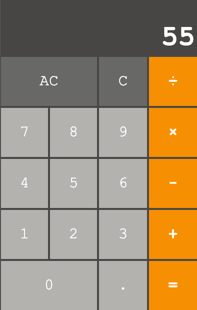

# SimplyCalc

Simple Calculator Extension for Chrome. Currently, only supports the four basic operations (addition, subtraction, multiplication and division). Additional operations may be added - as a different mode - in the future.

### Program Running on Chrome:

